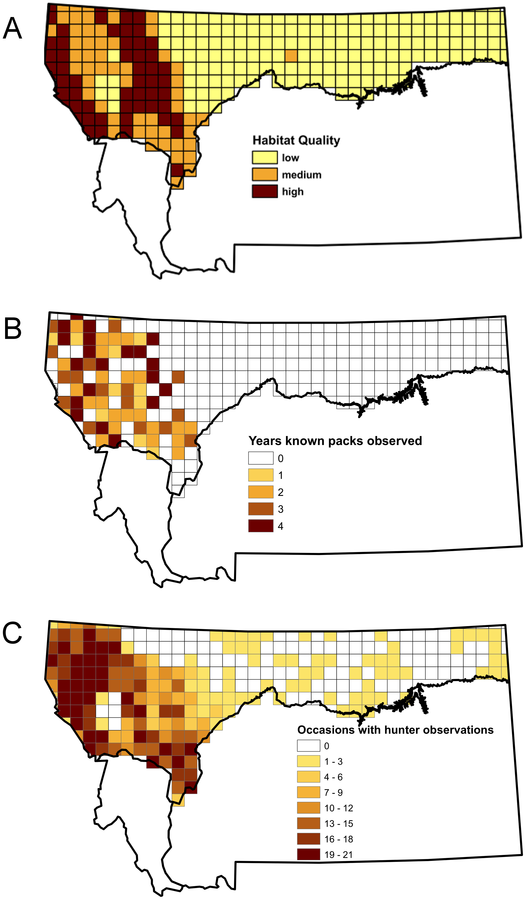

```{r setup, include=FALSE}
knitr::opts_chunk$set(echo = TRUE, 
                      message = FALSE, 
                      warning = FALSE, 
                      dpi = 300, 
                      fig.height = 6, 
                      fig.width = 1.777777*6)
```

# Objective

+ Fit (static) occupancy models accomodating false positives

# Pre-requisites

Load some packages:
```{r}
library(unmarked)
```

# Data

## Description

We use data from the paper *Determining Occurrence Dynamics when False Positives Occur: Estimating the Range Dynamics of Wolves from Public Survey Data* by Miller et al. published in Plos One and available at <https://journals.plos.org/plosone/article?id=10.1371/journal.pone.0065808>.

Data are of 2 types. There are data from hunters who report whether they observed wolves while hunting for deer or elk. Other data comes from observations made by state agency personnel based on collaring and relocation by radio telemetry. Covariates include the amount of hunter effort, habitat quality, and whether observations were by hunters or agency personnel. Static analysis uses data from the year 2010.

We thank David Miller for sharing the data.

In the figure below, we display the data. Cells were divided based on perceived habitat quality into low, medium, and high quality categories (A). Most certain observations of known packs made by state agency personnel and based on collaring and relocation by radio telemetry were concentrated in the western end of the study area where the higher quality habitat was located (B). While high frequency of observations by hunters also occurred in high-quality areas, they also reported a low frequency of wolf observations in the eastern portion of the study area, which we suspected were due to mis-identification (C).
```{r echo=FALSE, fig.width=5, fig.height=15, fig.align='center'}

```

## Read in data

Read in data:
```{r}
wolves <- read.csv("data/MTwolves.csv")
```

Inspect data:
```{r}
str(wolves)
```

Short description to be done.

# Modelling

## Start with only hunter reporting data for wolves and no accounting for false positives

Build list of covariate:
```{r}
oc <- list(effort = wolves[,47:51])
```

Organise data and covariates:
```{r}
umf <- unmarkedFrameOccu(y = wolves[,20:24], obsCovs = oc)
```

Summarize data:
```{r}
str(umf)
```

Fit model:
```{r}
fm1 <- occu(~effort ~ 1, data = umf)
```

Display model coefficients (parameters)
```{r}
coef(fm1)
```

Get occupancy probability estimate:
```{r}
1/(1 + exp(-coef(fm1)[1]))
```

Or:
```{r}
plogis(coef(fm1)[1])
```

Or:
```{r}
backTransform(fm1, 'state')
```

Now let's plot the detection probability for hunters as a function of effort:
```{r}
effort_grid <- seq(min(oc$effort), max(oc$effort), length = 100) # grid
logitp <- coef(fm1)[2] + coef(fm1)[3] * effort_grid # predictions on logit scale
p <- plogis(logitp) # back-transformation
plot(effort_grid, 
     p, 
     type = "l", 
     lwd = 3, 
     xlab = "effort", 
     ylab = "detection probability",
     ylim = c(0,1))
```

Compare figure below with Figure 3 in Miller and colleagues' paper.

## Still only data for hunters but account for false positives

Get covariates:
```{r}
effort <- matrix(unlist(wolves[,47:51]), nrow(wolves), 5)
oc <- list(effort = effort)
```

Organise data and covariates using `unmarkedFrameOccuFP` function. Note the extra argument `type` which takes a vector with 3 values designating the number of occasions where data is of type 1, type 2, and type 3. For type 1 data, false positive detections are assumed not to occur. For type 2 data, both false negative and false positive detection probabilities are estimated. Both p or p11 (the true positive detection probability) and fp or p01 (the false positive detection probability) are estimated for occasions when this data type occurs. For type 3 data, observations are assumed to include both certain detections (false positives assumed not to occur) and uncertain detections that may include false positive detections. Let's get to it:
```{r}
umfFP <- unmarkedFrameOccuFP(y = wolves[,20:24],
                             obsCovs = oc, 
                             type = c(0,5,0)) # 5 columns are of type 2
```

Summarize data:
```{r}
str(umfFP)                     
```
Fit model with effort on both detection and false positive detection probabilities:
```{r}
fm2 <- occuFP(detformula = ~effort, # detection
              FPformula = ~effort, # false positive detection
              Bformula = ~1, # probability detections are certain
              stateformula = ~1, # occupancy
              starts = c(0, 0, 0, -5, 0), # initial values
              data = umfFP)
```

Inspect estimates:
```{r}
coef(fm2)
```

Get occupancy prob estimate:
```{r}
backTransform(fm2, 'state')
```

## Add in the agency data

Build covariates:
```{r}
effort <- matrix(unlist(wolves[,c(52,47:51)]), nrow(wolves), 6)
oc <- list(effort = effort)
```

Get detections and non-detections:
```{r}
y <- wolves[,c(25,20:24)]
y[,1] <- y[,1] / 2
```

Organise data and covariates:
```{r}
umfFP <- unmarkedFrameOccuFP(y = y,
                             obsCovs = oc, 
                             type = c(1,5,0)) # first column of type 1, 5 columns of type 2
```

Summarize data:
```{r}
str(umfFP)                     
```

Fit model:
```{r}
fm3 <- occuFP(detformula = ~effort, # detection
              FPformula = ~effort, # false positives detection
              Bformula = ~1, # probability detections are certain
              stateformula = ~1, # occupancy
              starts = c(0, 0, 0, -5, 0), # initial values
              data = umfFP) 
```

Print results:
```{r}
fm3
```

## Account for habitat quality

Get covariates:
```{r}
effort <- matrix(unlist(wolves[,c(52,47:51)]), nrow(wolves), 6)
oc <- list(effort = effort)
```

Get detections and non-detections:
```{r}
y <- wolves[,c(25,20:24)]
y[,1] <- y[,1] / 2
```

Organise data and covariates:
```{r}
umfFP <- unmarkedFrameOccuFP(y = y,
                             siteCovs = wolves[,26:28],
                             obsCovs = oc, 
                             type = c(1,5,0)) # first column of type 1, 5 columns of type 2
```

Summarize data:
```{r}
str(umfFP)                     
```

Fit model:
```{r}
fm4 <- occuFP(detformula = ~effort, # detection
              FPformula = ~effort, # false positives detection
              Bformula = ~1, # probability detections are certain
              stateformula = ~High + Medium + Low - 1, # occupancy
              starts = c(0, 0, 0, 0, 0, -5, 0), # initial values
              data = umfFP)
```

Occupancy estimates for each level of habitat quality, starting by high:
```{r}
lc <- linearComb(fm4, c(1, 0, 0), type="state") # occ on the logit scale when high
psi_high <- backTransform(lc)
```

Then medium:
```{r}
lc <- linearComb(fm4, c(0, 1, 0), type="state") # occ on the logit scale when medium
psi_medium <- backTransform(lc)
```

Eventually low:
```{r}
lc <- linearComb(fm4, c(0, 0, 1), type="state") # occ on the logit scale when low
psi_low <- backTransform(lc)
```

Compare the following estimates with Figure 4, upper left panel:
```{r}
psi_high@estimate
psi_medium@estimate
psi_low@estimate
```

Get detection estimates as a function of effort:
```{r}
effort_grid <- seq(min(oc$effort), max(oc$effort), length = 100)
p11 <- plogis(coef(fm4)[4] + coef(fm4)[5] * effort_grid) # detection
p01 <- plogis(coef(fm4)[6] + coef(fm4)[7] * effort_grid) # false positives detection
```

Compare figure below with Figure 3:
```{r}
plot(effort_grid, 
     p11, 
     type = "l", 
     lwd = 3, 
     xlab = "effort", 
     ylab = "detection probability",
     col = "red",
     ylim = c(0,1))
lines(effort_grid, 
     p01,
     lwd = 3, 
     col = "blue")
legend("bottomright", legend = c("true positive det prob (p11)",
                                 "false positive det prob (p01)"),
                                 col = c("red", "blue"), 
       lwd = 3)
```

Both the true positive (p11) and false positive (p01) detection probabilities increase as hunter effort increases (Figure 3). False positive probabilities are greater than 0.5 in areas with the greatest hunting effort. 

